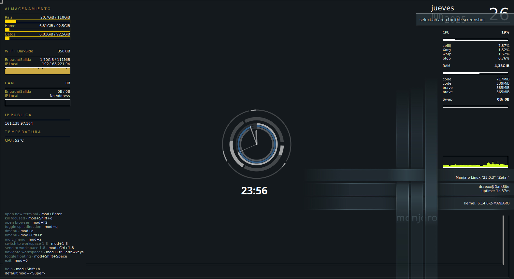
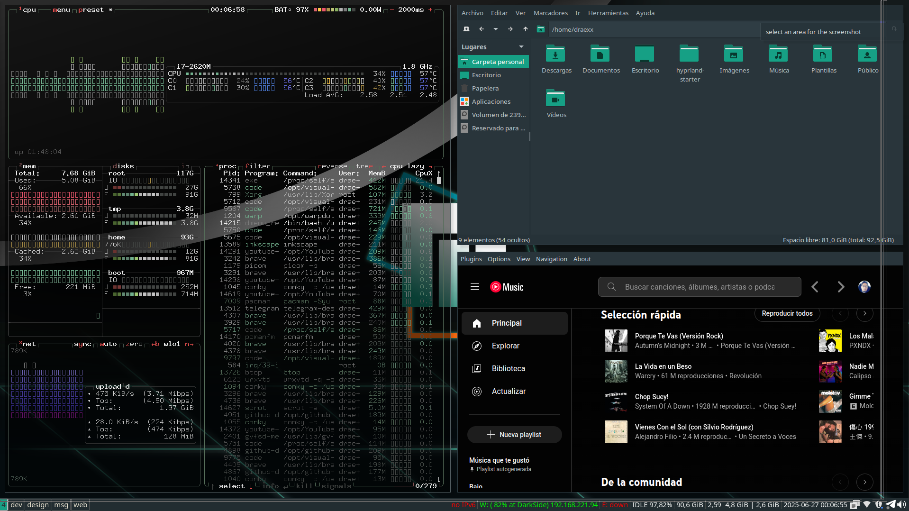
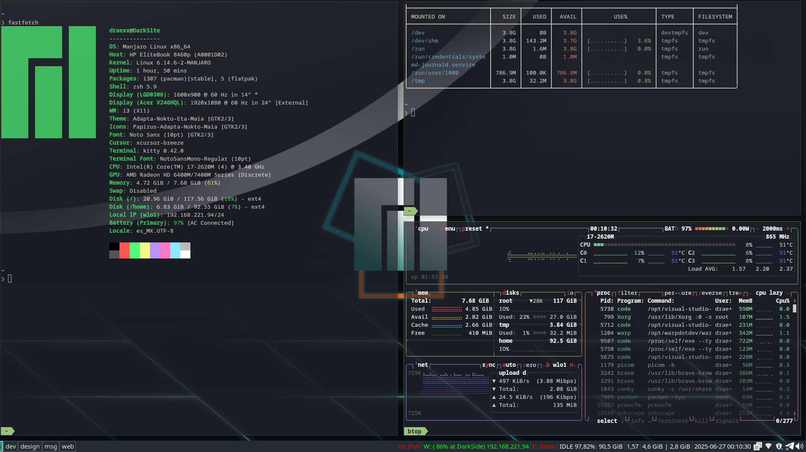
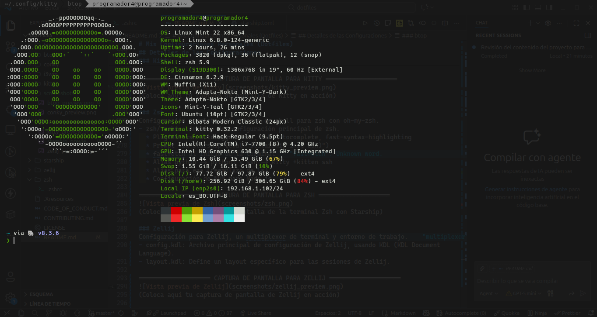
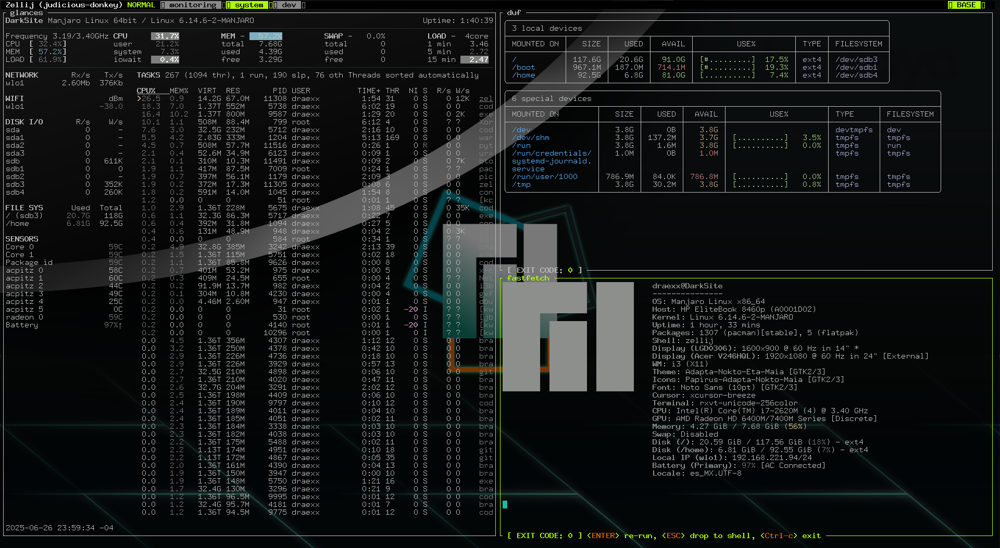
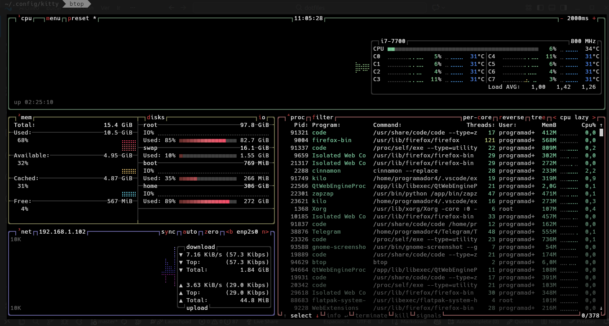
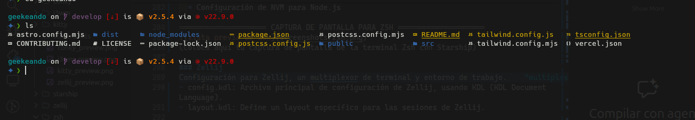

# 🖥️ Mis Configuraciones Personales (Dotfiles)

Este repositorio contiene mi colección personal de archivos de configuración para diversas herramientas y aplicaciones que uso en **Linux** (i3wm) y **macOS** (MacBook Air). El objetivo es mantener un entorno de trabajo consistente, productivo y estéticamente agradable.

## Tabla de Contenidos

- [Requerimientos](#requerimientos)
- [Instalación](#instalación)
- [Uso](#uso)
- [Detalles de las Configuraciones](#detalles-de-las-configuraciones)
- [Herramientas Adicionales](#herramientas-adicionales)
- [Notas macOS](#notas-macos)
- [Agradecimientos](#agradecimientos)

---

## Requerimientos

Para utilizar estas configuraciones, necesitarás tener instalados los siguientes programas.

### General

| Herramienta | apt (Debian/Ubuntu) | pacman (Arch) | brew (macOS) |
|---|---|---|---|
| **zsh** | `sudo apt install zsh` | `sudo pacman -S zsh` | `brew install zsh` |
| **oh-my-zsh** | [ohmyz.sh](https://ohmyz.sh/) | [ohmyz.sh](https://ohmyz.sh/) | [ohmyz.sh](https://ohmyz.sh/) |
| **starship** | `sudo apt install starship` | `sudo pacman -S starship` | `brew install starship` |
| **fastfetch** | `sudo apt install fastfetch` | `sudo pacman -S fastfetch` | `brew install fastfetch` |
| **btop** | `sudo apt install btop` | `sudo pacman -S btop` | `brew install btop` |
| **glances** | `sudo apt install glances` | `sudo pacman -S glances` | `brew install glances` |
| **eza** | `sudo apt install eza` | `sudo pacman -S eza` | `brew install eza` |
| **duf** | `sudo apt install duf` | `sudo pacman -S duf` | `brew install duf` |
| **kitty** | `sudo apt install kitty` | `sudo pacman -S kitty` | `brew install kitty` |
| **zellij** | `cargo install --locked zellij` | `sudo pacman -S zellij` | `brew install zellij` |
| **cmatrix** | `sudo apt install cmatrix` | `sudo pacman -S cmatrix` | `brew install cmatrix` |

- **Hack Nerd Font:** fuente usada en Kitty, necesaria para los íconos.
  - Linux: descargá desde [nerdfonts.com](https://www.nerdfonts.com/font-downloads) y colocá en `~/.local/share/fonts/`
  - macOS: `brew install font-hack-nerd-font`
- **VSCode o Cursor:** editores de código. Descargá desde [code.visualstudio.com](https://code.visualstudio.com/) o [cursor.sh](https://cursor.sh/)

> Nota: algunos paquetes pueden requerir repositorios adicionales (PPAs en Ubuntu, AUR en Arch) según tu distribución y versión.

### Plugins de Zsh (instalación manual)

```bash
# zsh-autosuggestions
git clone https://github.com/zsh-users/zsh-autosuggestions \
  ${ZSH_CUSTOM:-~/.oh-my-zsh/custom}/plugins/zsh-autosuggestions

# zsh-autocomplete
git clone --depth 1 https://github.com/marlonrichert/zsh-autocomplete.git \
  ${ZSH_CUSTOM:-~/.oh-my-zsh/custom}/plugins/zsh-autocomplete

# fast-syntax-highlighting
git clone https://github.com/zdharma-continuum/fast-syntax-highlighting.git \
  ${ZSH_CUSTOM:-~/.oh-my-zsh/custom}/plugins/fast-syntax-highlighting
```

### Específicos de Linux

| Herramienta | apt | pacman |
|---|---|---|
| **i3-wm** | `sudo apt install i3` | `sudo pacman -S i3-wm` |
| **i3status** | `sudo apt install i3status` | `sudo pacman -S i3status` |
| **dmenu / rofi** | `sudo apt install rofi` | `sudo pacman -S rofi` |
| **feh** | `sudo apt install feh` | `sudo pacman -S feh` |
| **Conky** | `sudo apt install conky-all` | `sudo pacman -S conky` |
| **Lua** | `sudo apt install lua5.3` | `sudo pacman -S lua` |

---

## Instalación

> ⚠️ **Advertencia:** realizá una copia de seguridad de tus configuraciones actuales antes de proceder, ya que los siguientes comandos pueden sobrescribir archivos existentes.

### 1. Clonar el repositorio

```bash
git clone https://github.com/draexx/dotfiles.git
cd dotfiles
```

### 2. Copiar los archivos de configuración

**Conky:**
```bash
mkdir -p ~/.config/conky
cp -r conky/* ~/.config/conky/
```

**i3wm:**
```bash
mkdir -p ~/.config/i3
cp i3wm/config ~/.config/i3/config
cp i3wm/i3status.conf ~/.config/i3/i3status.conf
```

**Kitty:**
```bash
mkdir -p ~/.config/kitty
cp kitty/kitty.conf ~/.config/kitty/kitty.conf
```
La configuración es completamente autónoma — no requiere `theme.conf` ni `colors.conf` externos. Los colores ANSI y el esquema visual están integrados directamente en `kitty.conf`.

**Zsh:**
```bash
# Primero instalá los plugins (ver sección Requerimientos arriba)
cp zsh/.zshrc ~/.zshrc
source ~/.zshrc
```

**Zellij:**
```bash
mkdir -p ~/.config/zellij
cp zellij/config.kdl ~/.config/zellij/config.kdl
cp zellij/layout.kdl ~/.config/zellij/layout.kdl
```

**Starship:**
```bash
mkdir -p ~/.config
cp starship/starship.toml ~/.config/starship.toml
```
Starship se inicializa automáticamente desde el `.zshrc`. La configuración personalizada se encuentra en `starship/starship.toml`.

**btop:**
```bash
mkdir -p ~/.config/btop
cp btop/btop.conf ~/.config/btop/btop.conf
```

> Revisá las rutas y nombres de los archivos de cada programa, ya que pueden variar ligeramente según tu sistema.

---

## Uso

### Conky

Para iniciar Conky con una configuración específica:
```bash
conky -c ~/.config/conky/conky_maia
```
Reemplazá `conky_maia` con cualquier otro archivo de la carpeta `conky/`.

Para que Conky se inicie automáticamente:
- **En i3wm:** agregá `exec --no-startup-id conky -c ~/.config/conky/conky_maia` a `~/.config/i3/config`
- **En otros entornos (GNOME, KDE, XFCE):** buscá "Aplicaciones al inicio" o "Autostart"

### i3wm

1. Copiá el archivo `config` a `~/.config/i3/config`
2. En la pantalla de login, seleccioná **i3** como sesión
3. Para recargar la config sin cerrar sesión: `Mod+Shift+R`

Revisá `~/.config/i3/config` para ver los atajos de teclado personalizados.

### Kitty

Kitty aplica automáticamente la configuración de `~/.config/kitty/kitty.conf` al iniciar.

- Fuente: Hack Regular, 9.5pt con paleta estilo GNOME Terminal (`#171717` de fondo)
- Pestañas en la parte superior con estilo `powerline angled`
- Para recargar sin cerrar: `Ctrl+Shift+F5`

| Atajo | Acción |
|---|---|
| `Ctrl+Shift+T` | Nueva pestaña |
| `Ctrl+Shift+Q` | Cerrar pestaña |
| `Ctrl+Shift+→` | Siguiente pestaña |
| `Ctrl+Shift+←` | Pestaña anterior |
| `Ctrl+Shift+Alt+T` | Renombrar pestaña |
| `Ctrl+Shift+D` | Split vertical |
| `Ctrl+Shift+S` | Split horizontal |
| `Ctrl+Shift+C` | Copiar |
| `Ctrl+Shift+V` | Pegar |
| `Ctrl+Shift+F5` | Recargar config |

### Zsh

El archivo `zsh/.zshrc` configura el entorno completo con oh-my-zsh y los siguientes plugins:

- **zsh-autosuggestions:** sugiere comandos del historial mientras escribís
- **zsh-autocomplete:** autocompletado en tiempo real con menú interactivo
- **fast-syntax-highlighting:** resaltado de sintaxis en la línea de comandos

Además incluye:
- `fastfetch` al iniciar la terminal para mostrar info del sistema
- `starship` como prompt visual
- `alias ssh="kitty +kitten ssh"` para mantener la fuente en conexiones remotas
- Corrección del comportamiento de flechas con `zsh-autocomplete`
- Alias para `eza` que reemplazan `ls` con íconos y colores
- Alias `python → python3` para compatibilidad

### Zellij

```bash
zellij                                          # Iniciar con config default
zellij --layout ~/.config/zellij/layout.kdl     # Iniciar con layout personalizado
```

### Starship

Starship se inicializa automáticamente mediante `eval "$(starship init zsh)"` en el `.zshrc`. El prompt se aplica al abrir cualquier terminal Zsh. La configuración personalizada se encuentra en `~/.config/starship.toml`.

---

## Detalles de las Configuraciones

### CONKY

Archivos de configuración para Conky, monitor de sistema ligero y personalizable para X11.

- `clock_rings_maia.lua` — script Lua para un widget de reloj con anillos
- `conky_lua_maia`
- `conky_maia`
- `conky_maia1`
- `conky_shortcuts_live_maia`
- `conky1.10_shortcuts_maia`



### i3wm

Configuración personalizada para i3-wm, gestor de ventanas tiling para X11.

- `config` — archivo principal de configuración de i3
- `config-i3` — variante o copia de seguridad
- `i3status.conf` — configuración de la barra de estado



### Kitty

Configuración para Kitty, emulador de terminal rápido con aceleración GPU.

- `kitty.conf` — configuración completa y autónoma
  - Fuente: Hack Regular, 9.5pt
  - Tema: colores estilo GNOME Terminal con paleta ANSI completa (16 colores) integrada
  - Pestañas: barra superior con estilo `powerline angled`
  - Opacidad: 90% de transparencia de fondo
  - Splits nativos de ventana sin necesidad de Zellij

> **Nota:** los archivos `theme.conf` y `colors.conf` ya no son necesarios — todo está integrado directamente en `kitty.conf`.



### Zsh

Configuración completa del entorno de shell con oh-my-zsh.

- `zsh/.zshrc` — archivo de configuración principal
  - Plugins: `zsh-autosuggestions`, `zsh-autocomplete`, `fast-syntax-highlighting`
  - Prompt via Starship (`eval "$(starship init zsh)"`)
  - `fastfetch` al inicio de la terminal
  - Alias `python → python3` y `ssh → kitty +kitten ssh`
  - Alias para `eza` (reemplazo de `ls`)
  - Configuración de NVM para Node.js



### Zellij

Configuración para Zellij, multiplexor de terminal y entorno de trabajo.

- `config.kdl` — archivo principal de configuración (KDL Document Language)
- `layout.kdl` — define el layout de paneles para las sesiones



### btop

Configuración para btop, monitor de sistema TUI.

- `btop.conf` — define tema, intervalo de actualización e información a mostrar
  - Tema: gruvbox_dark
  - Intervalo: 1.5 segundos
  - Gráficas tipo braille para mayor detalle visual



### Starship

Configuración personalizada del prompt para Zsh.

- `starship.toml` — define formato, colores y módulos del prompt
  - Paleta coherente con los colores GNOME dark de Kitty
  - Módulos activos: OS, directorio, git, Python, Node.js, Rust, Go, Docker, duración del comando



---

## Herramientas Adicionales

Herramientas sin archivo de configuración propio en este repo, pero parte del stack.

### glances — Monitor en tiempo real

Alternativa moderna a `top` y `htop` con soporte Docker y API REST.

```bash
glances        # Monitor interactivo
glances -w     # Modo web en http://localhost:61208
```
Podés cambiar el tema presionando `2` (oscuro) o `5` (claro).

### duf — Uso de disco visual

Alternativa visual a `df`. Alias configurado en `.zshrc`.

```bash
duf                            # Ver todos los discos
duf --only-fs ext4,ntfs,apfs   # Filtrar por tipo de filesystem
```

### cmatrix — Efecto Matrix

```bash
cmatrix -b -C cyan    # Efecto azul en lugar de verde
```

---

## Notas macOS

Diferencias y consideraciones para MacBook Air:

- **Homebrew** se inicializa automáticamente en el `.zshrc` (compatible con Apple Silicon e Intel)
- **Kitty** funciona en macOS; si `TERM=xterm-kitty` causa problemas en SSH, el `.zshrc` lo ajusta automáticamente
- **i3wm y Conky** son exclusivos de Linux — no aplican en macOS
- **Fuente:** instalá con `brew install font-hack-nerd-font`
- **Actualización del sistema:** usá el alias `update-mac` → `brew update && brew upgrade`
- **Zellij en macOS:** `brew install zellij`

---

## Agradecimientos

Este proyecto se ha inspirado en el trabajo de muchas personas en la comunidad de personalización de Linux.

- Comunidad de [r/unixporn](https://reddit.com/r/unixporn) por la inspiración constante
- Inspirado por los dotfiles de otros proyectos de código abierto
- Proyectos: [Oh My Zsh](https://ohmyz.sh/), [Starship](https://starship.rs/), [Zellij](https://zellij.dev/), [btop](https://github.com/aristocratos/btop), [eza](https://github.com/eza-community/eza)

---

Si encontrás algún problema o tenés sugerencias, no dudes en abrir un [issue](https://github.com/draexx/dotfiles/issues).