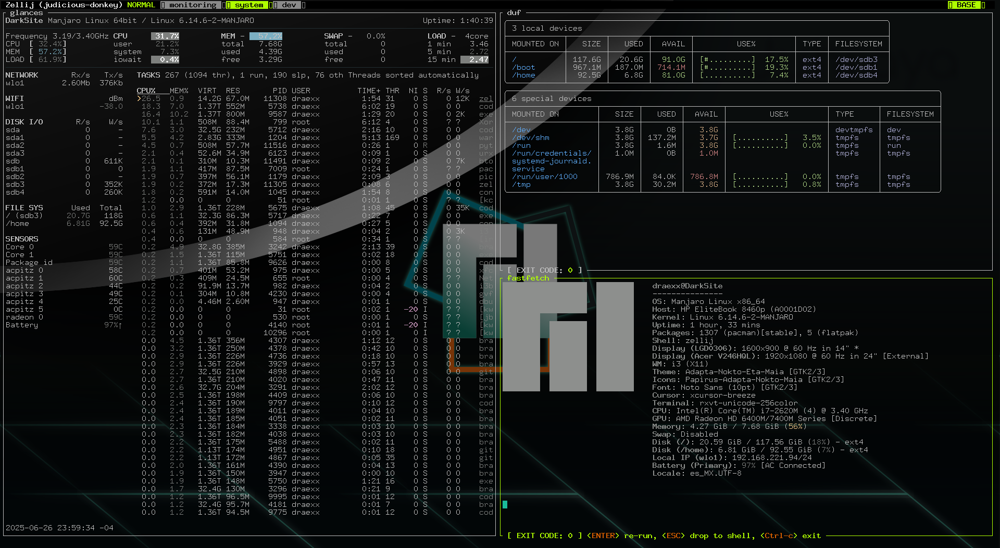

# Configuración
Archivos de configuración de mi sistema operativo.

## Requerimientos
Para utilizar estas configuraciones, asegúrate de tener instalados los siguientes programas:
- `zsh`
- `oh-my-zsh`
- `starship`
- `VSCode` o `Cursor`
- `glances`
- `eza`
- `duf`
- `fastfetch`

## CONKY
Archivos relacionados con la aplicación Conky:
- `clock_rings_maia.lua`
- `conky_lua_maia`
- `conky_maia`
- `conky_maia1`
- `conky_shortcuts_live_maia`
- `conky1.10_shortcuts_maia`

### Vista previa

## i3wm
Configuración personalizada para i3-wm:
- `config`
- `config-i3`
- `i3status.conf`

### Vista previa

## Kitty
Configuración para el terminal Kitty:
- `theme.conf`
- `colors.conf`
- `kitty.conf`

### Kitty Themes
Temas para Kitty disponibles en el directorio `kitty-themes`:
- `.all-contributorsrc`
- `CONTRIBUTING.md`
- `LICENSE.md`
- `README.md`

Scripts y herramientas adicionales:
- `.tools/color_table.sh`

Temas disponibles en `kitty-themes/themes`.

### Vista previa

## Zellij
Configuración para Zellij:
- `config.kdl`
- `layout.kdl`

### Vista previa
